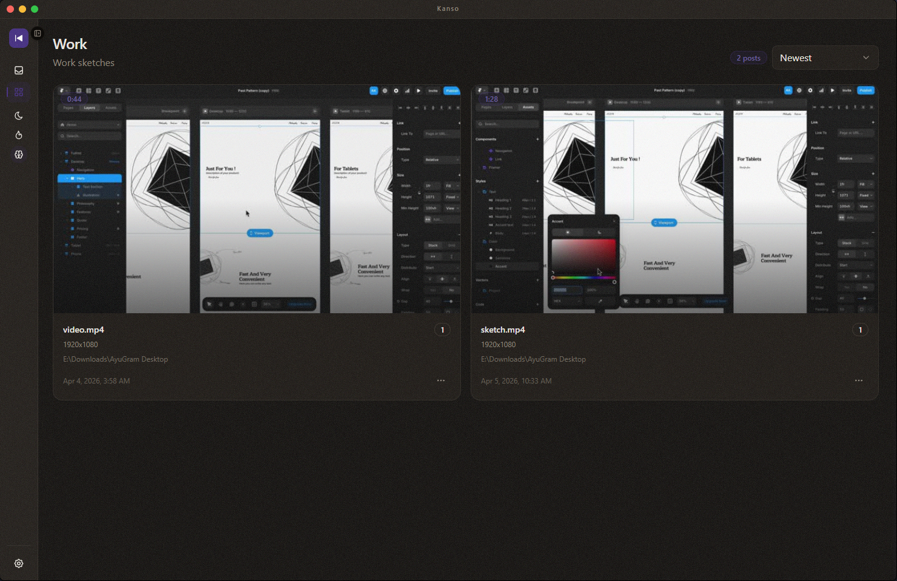

<div align="center">

<h1>Kanso</h1>



**Video player for people tired of ugly media apps.**

*Zen-like desktop player with forum-style organization, noise texture, and smooth motion.*

[](https://github.com/psychosomat/Kanso/releases)
[](https://github.com/psychosomat/Kanso/releases)
[](https://github.com/psychosomat/Kanso/blob/main/LICENSE)
[](https://github.com/psychosomat/Kanso/issues)
[](https://github.com/psychosomat/Kanso/stargazers)

[](https://www.electronjs.org/)
[](https://react.dev/)
[](https://tanstack.com/)
[](https://bun.sh/)
[](https://www.sqlite.org/)

[Download Installer](https://github.com/psychosomat/Kanso/releases) • [Source Code](https://github.com/psychosomat/Kanso) • [Report Issue](https://github.com/psychosomat/Kanso/issues)

</div>

## Why Kanso

Most players feel like old utilities with random controls, broken flow, and clumsy motion.

Kanso is built around a different standard:

| Focus | What you get |
| --- | --- |
| `Usability first` | Less friction, less hunting, less UI noise |
| `Beautiful by default` | Zen Browser-inspired atmosphere, textured surfaces, smooth animation |
| `Local-first` | Your library stays on your machine |
| `Open source` | Download the installer or run the code yourself |

## Snapshot

| Mode | Status |
| --- | --- |
| Platform | [](https://github.com/psychosomat/Kanso/releases) [](https://github.com/psychosomat/Kanso/releases) [](https://github.com/psychosomat/Kanso/releases) |
| Delivery | `Installer from Releases` + `source build` |
| Library | `Local folders` + `watch mode` + `rescan` |
| Organization | `Forum-style categories` + `uncategorized dump` |
| Playback | `speed presets` + `resume logic` + `timeline preview` |
| Metadata | `posters` + `duration` + `resolution` + `codec data` |

## What Makes It Different

| | |
| --- | --- |
| `No bloated media-center nonsense` | Kanso is focused on watching and organizing your videos, not pretending to be ten apps at once. |
| `Built for visual comfort` | Soft hierarchy, restrained minimalism, textured surfaces, deliberate motion. |
| `Actually useful library flow` | Add folders, watch them automatically, sort the uncategorized dump, move videos into boards. |
| `Desktop-first workflow` | Reveal file, open folder, copy path, resume where you left off. |

## Install

### Option A: Installer

Download the latest Windows build from [Releases](https://github.com/psychosomat/Kanso/releases).

### Option B: Run From Source

```bash
bun i
bun dev
```

### Option C: Arch Linux (AUR)

```bash
# Using an AUR helper like yay or paru
paru -S kanso-bin

```

## Build

```bash
bun dist
```

## Roadmap Signal

`Early stage` does not mean accidental.

The project is intentionally being shaped around:

- stronger long-term maintainability
- cleaner UI systems
- faster desktop interactions
- better library ergonomics than typical video players

## License

[MIT](https://github.com/psychosomat/Kanso/blob/main/LICENSE)
