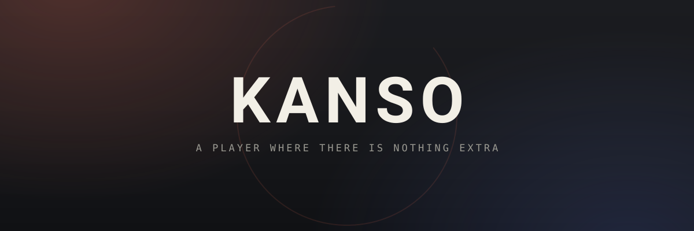
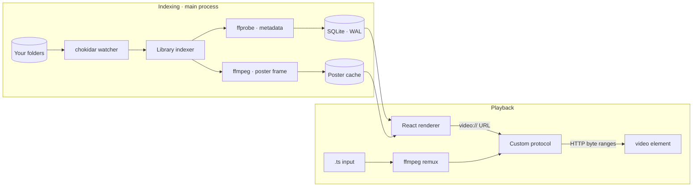

<div align="center">



<br />

[](https://github.com/psychosomat/Kanso/releases/latest)
[](LICENSE)
[](#install)
[](#tech-stack)

</div>

Kanso is a local-first desktop media player for people with large video libraries. Point it at your folders and it builds a searchable library on its own: it watches for changes, extracts metadata and poster frames, and gives you boards to sort videos into. It never moves, renames, or uploads a file.

The name comes from *kanso* (簡素), the Zen principle of simplicity — remove the non-essential until only what matters remains. The interface follows the same rule.

> [!NOTE]
> Kanso is under active development. Expect rough edges; bug reports and product ideas are welcome.

## Features

<table>
<tr>
<td width="50%" valign="top">
<p><b>Local-first, no accounts</b></p>
<p>Your files stay exactly where they are. Kanso indexes in place, keeps metadata in a local SQLite database, and works fully offline. No telemetry, no cloud, no sign-in.</p>
</td>
<td width="50%" valign="top">
<p><b>Boards, not folders</b></p>
<p>Organize videos into nested boards with icons and captions. Drag a card straight onto a board, and keep everything unassigned in the Unsorted inbox.</p>
</td>
</tr>
<tr>
<td width="50%" valign="top">
<p><b>An index that maintains itself</b></p>
<p>A chokidar watcher catches added, changed, and removed files. <code>ffprobe</code> reads duration, resolution, codecs, and bitrate; <code>ffmpeg</code> renders a poster frame for every video.</p>
</td>
<td width="50%" valign="top">
<p><b>Built for the keyboard</b></p>
<p>A command palette jumps to any board, video, or action. Playback runs on hotkeys, and the sidebar reveals on hover or pins into the layout.</p>
</td>
</tr>
<tr>
<td width="50%" valign="top">
<p><b>Playback with depth</b></p>
<p>Byte-range streaming, resume from where you stopped, hover frame previews on the timeline, a 6-band equalizer, and playback-speed presets you can fine-tune by scrolling.</p>
</td>
<td width="50%" valign="top">
<p><b>Native where it counts</b></p>
<p>A frameless titlebar that adapts per OS, video file associations, a Windows Explorer thumbnail provider, a macOS QuickLook provider, and single-instance file opening.</p>
</td>
</tr>
</table>

## How it works


```mermaid
flowchart LR
  subgraph Indexing["Indexing · main process"]
    direction LR
    FOLDERS[("Your folders")] --> WATCH["chokidar watcher"]
    WATCH --> INDEX["Library indexer"]
    INDEX --> PROBE["ffprobe · metadata"]
    INDEX --> POSTER["ffmpeg · poster frame"]
    PROBE --> DB[("SQLite · WAL")]
    POSTER --> CACHE[("Poster cache")]
  end

  subgraph Playback["Playback"]
    direction LR
    UI["React renderer"] -->|"video:// URL"| PROTOCOL["Custom protocol"]
    PROTOCOL -->|"HTTP byte ranges"| VIDEO["video element"]
    TS[".ts input"] --> REMUX["ffmpeg remux"] --> PROTOCOL
  end

  DB --> UI
  CACHE --> UI
```

The renderer never touches the filesystem directly. Every operation crosses a typed IPC bridge, and playback streams through a custom `video://` protocol that serves HTTP range requests — so seeking is instant even on multi-gigabyte files. MPEG-TS input is remuxed to MP4 by the bundled `ffmpeg` before it reaches the player.

## Install

Prebuilt packages for every platform live on the [Releases](https://github.com/psychosomat/Kanso/releases/latest) page.

| Platform | Package |
| :--- | :--- |
| Windows | `.exe` (NSIS installer) |
| macOS (Apple silicon) | `.dmg`, `.zip` |
| macOS (Intel) | `.dmg`, `.zip` |
| Linux · Debian/Ubuntu | `.deb` |
| Linux · Arch | [`kanso-bin`](https://aur.archlinux.org/packages/kanso-bin) — `yay -S kanso-bin` |
| Linux · other | `.AppImage`, `.tar.gz`, `.pacman` |

> [!NOTE]
> macOS builds are unsigned. On first launch, allow the app in **System Settings → Privacy & Security**.

## Build from source

Requirements: [Bun](https://bun.sh) `>= 1.22.5`, [Node.js](https://nodejs.org) `>= 20.19`, Git, and a C++ toolchain for rebuilding native modules.

```bash
git clone https://github.com/psychosomat/Kanso.git
cd Kanso
bun install
bun run dev
```

`bun run dev` starts the Vite dev server, watches the Electron main and preload bundles, and launches the app when both are ready.

To produce installers:

```bash
bun run build        # compile renderer + main process
bun run dist         # package for the current platform
bun run dist:linux   # deb, pacman, tar.gz, AppImage
bun run dist:win     # NSIS (also builds the Explorer thumbnail provider)
bun run dist:mac     # dmg + zip (also builds the QuickLook provider)
```

## Keyboard shortcuts

| Shortcut | Action |
| :--- | :--- |
| `Space` / `K` | Play / pause |
| `J` / `L` | Seek back / forward 5s |
| `←` / `→` | Seek back / forward 5s |
| `↑` / `↓` | Volume up / down |
| `M` | Mute |
| `F` | Fullscreen |
| `R` | Toggle loop |
| Double-click | Fullscreen |
| Scroll on the gauge | Change speed by 0.2× |
| `Ctrl` / `⌘` + `P` | Command palette |
| `Ctrl` / `⌘` + `S` | Pin / unpin sidebar |

## Formats

Kanso indexes these extensions: `.mp4`, `.mkv`, `.webm`, `.mov`, `.avi`, `.m4v`, `.ts`.

MPEG-TS (`.ts`) files are remuxed to MP4 on the fly by the bundled `ffmpeg`, so they stream without re-encoding. Playback of other containers depends on the codecs supported by Electron's media stack.

## Where your data lives

Kanso keeps everything inside Electron's per-user application data directory:

- `data/player.db` — the SQLite library (WAL mode)
- `cache/posters` — generated poster frames
- `cache/transmux` — remuxed MP4 files for `.ts` sources

Source videos are never modified. Removing an entry from the library deletes the index record and its board posts, not the file on disk.

## Tech stack

| Layer | Choice |
| :--- | :--- |
| Shell | Electron 41 |
| UI | React 19, TanStack Router, Tailwind CSS 4, Radix UI, GSAP |
| State & data | better-sqlite3 (WAL), typed IPC contracts |
| Media | ffmpeg-static, ffprobe-static, custom `video://` protocol |
| File watching | chokidar |
| Tooling | Vite 7, TypeScript, Biome, Vitest, Bun |

## Project layout

```
electron/            Main process
  ipc/               Typed IPC bridge
  services/          db, indexer, file watcher, metadata, posters, transmuxer
src/                 Renderer
  routes/            TanStack Router file routes (dump, boards, player, settings)
  components/        UI, layout, player, categories
  lib/               Shared contracts, equalizer, utils
build-resources/     Windows (.NET) and macOS (QuickLook) thumbnail providers
packaging/aur/       Arch Linux PKGBUILD
scripts/dev.mjs      Development orchestrator
```

## Development

| Command | Description |
| :--- | :--- |
| `bun run dev` | Run the app in development |
| `bun run build` | Compile the renderer and main process |
| `bun run dist` | Package installers for the current platform |
| `bun run lint` | Lint `src` and `electron` with Biome |
| `bun run check` | Lint and format with Biome |
| `bun run fmt` | Format with Biome |
| `bun run test` | Run the Vitest suite |

## Contributing

Issues are more valuable than pull requests here. Open an issue for bugs, UX problems, regressions, or ideas, and discuss larger changes before sending code. See [CONTRIBUTING.md](CONTRIBUTING.md).

## License

[MIT](LICENSE) © 2026 Dmitrii Dark (psychosomat)
