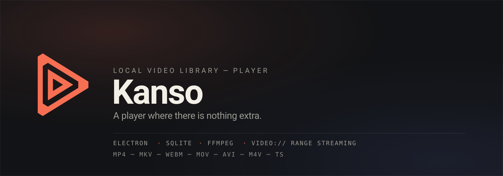
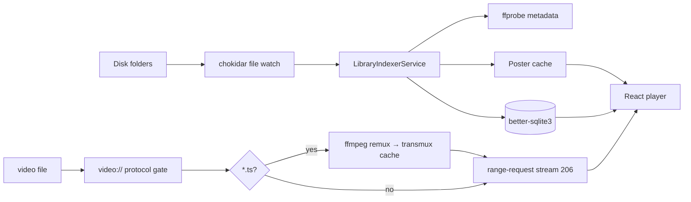

<picture>
  <source media="(prefers-color-scheme: light)" srcset="./assets/hero-light.svg">
  <source media="(prefers-color-scheme: dark)" srcset="./assets/hero-dark.svg">
  
</picture>

<p align="left">
  <a href="https://github.com/psychosomat/Kanso/actions/workflows/ci.yml"></a>
  
  
  
  
</p>

# Kanso

**Local video library and player. Index folders, browse a catalogue, play multi-gigabyte files with instant seeking — no server, no account, no telemetry.**

Kanso watches your directories, extracts metadata with `ffprobe`, caches posters, and streams files to the renderer over a privileged `video://` protocol with HTTP range requests. MPEG-TS (`.ts`) is remuxed to MP4 on the fly via bundled `ffmpeg` and served from cache afterwards.

---

## Architecture


```mermaid
flowchart LR
    D[Disk folders] --> W[chokidar file watch]
    W --> I[LibraryIndexerService]
    I --> M[ffprobe metadata]
    I --> P[Poster cache]
    I --> S[(better-sqlite3)]
    V[video file] --> G[video:// protocol gate]
    G --> T{*.ts?}
    T -->|yes| R[ffmpeg remux → transmux cache]
    T -->|no| H[range-request stream 206]
    R --> H
    H --> PL[React player]
    S --> PL
    P --> PL
```

| Layer | Implementation | Notes |
|---|---|---|
| Indexing | `electron/services/library-indexer.ts` + `file-watch.ts` | Full scan + live watch, configurable roots |
| Metadata | `electron/services/media-metadata.ts` (`ffprobe-static`) | Duration, streams, thumbnails source |
| Storage | `electron/services/db.ts` (`better-sqlite3`) | Library, categories, settings, playback state |
| Delivery | `video://` handler in `electron/main.ts` | `Accept-Ranges`, `206 Partial Content`, security gate on library roots |
| Compat | `electron/services/transmuxer.ts` (`ffmpeg-static`) | `.ts` → cached `.mp4`, deduplicated per source |
| OS | File associations, single instance, `open-file` | `mp4 · mkv · webm · mov · avi · m4v · ts` |
| Shell | macOS QuickLook, Windows thumbnail provider | `build-resources/macos-quicklook`, `build-resources/windows-thumbnail-provider` |

> [!NOTE]
> Decoding runs without GPU video decode by design (`disable-gpu-video-decoder`) to avoid 4K HEVC driver crashes. Compositing stays on GPU; only video decode falls back.

---

## Quick start

**Run from source — 3 commands:**

```bash
bun install
bun run dev
```

**Ship a binary:**

```bash
bun run build
bun run dist:win    # NSIS installer
bun run dist:linux  # deb / pacman / tar.gz / AppImage
bun run dist:mac    # dmg / zip
```

> [!TIP]
> `bun run dev` boots Vite + `tsup` watchers + Electron with `VITE_DEV_SERVER_URL` automatically (`scripts/dev.mjs`). No manual port juggling.

---

## Capabilities

<table border="0">
  <tr>
    <td width="50%" valign="top">
      <h3>Library, not file list</h3>
      <p>Watched roots, full rescan, categories and feeds. SQLite index keeps browsing instant while files change on disk.</p>
    </td>
    <td width="50%" valign="top">
      <h3>Instant seeking on large files</h3>
      <p>Privileged <code>video://</code> protocol serves byte ranges (<code>206</code>) straight from disk. Scrub a multi-GB file without buffering the whole asset.</p>
    </td>
  </tr>
  <tr>
    <td width="50%" valign="top">
      <h3>Broadcast files play anywhere</h3>
      <p>MPEG-TS recordings are remuxed once to cached MP4 and reused on every later open. No manual conversion step.</p>
    </td>
    <td width="50%" valign="top">
      <h3>Player built for long sessions</h3>
      <p>Speed 0.2×–4.0× with presets, A/B-free loop, 10-band EQ, fit modes, volume persistence, full keyboard transport.</p>
    </td>
  </tr>
</table>

---

## Player

| Input | Action |
|---|---|
| `Space` / `K` | Play / pause |
| `J` / `L`, `←` / `→` | Seek ∓ / ± |
| `Shift` + `J` / `L`, `Shift` + `←` / `→` | Long seek |
| `0`–`9` | Seek to 10% steps |
| `Home` / `End` | Start / end |
| `↑` / `↓` | Volume |
| `M` | Mute |
| `S`, `-` / `=` | Cycle speed, slower / faster |
| `R` | Loop |
| `F` | Fullscreen |
| `C` / `I` | Categories / details |
| `Esc` | Exit player |

Defaults from `src/lib/constants.ts`: volume `0.9`, rate `1.0×`, presets `1.0×` / `2.2×`, accent `#F76F53` (user-configurable in Settings).

<details>
<summary><b>Playback contract</b></summary>

- Rate range clamped to `0.2–4.0` (`normalizePlaybackRate`, `src/lib/player-playback.ts`).
- Repeatable keys (`J/L`, arrows, `-/=`) support key repeat; transport keys ignore `Ctrl/Meta/Alt` and editable targets.
- `Esc` unwinds topmost layer first (dialog → overlay → player), never skips a level.

</details>

---

## Formats and OS integration

| Area | Detail |
|---|---|
| Containers | `.mp4` `.mkv` `.webm` `.mov` `.avi` `.m4v` `.ts` |
| Open path | Double-click association, `second-instance` args, macOS `open-file` events |
| Window | Frameless, `hidden` / `hiddenInset` titlebar, 1480×960 adaptive to 85% of work area |
| Identity | `com.dark.kanso`, `public/favicon.ico` + `public/icon.png`, mark `public/logo.svg` (`#F76F53`) |
| Design tokens | `--background-deep #121316`, `--background #1A1B1E`, `--foreground #F2EFE6`, `--accent #F76F53`, `--accent-2 #6F8CF5`, Geist + Geist Mono |

<details>
<summary><b>Local data layout</b></summary>

Resolved from Electron `userData`:

- Database — `<userData>/data/player.db`
- Posters — `<userData>/cache/posters`
- Transmux cache — `<userData>/cache/transmux` (`<sha1(source)>.mp4`)

No network calls for library operation. Everything stays on disk.

</details>

---

## Develop

```bash
bun install --frozen-lockfile
bun run lint     # biome lint ./src ./electron
bun run check    # biome check --write
bun run test     # vitest run
bun run fmt      # biome format --write
```

| Script | Purpose |
|---|---|
| `bun run dev` | Vite + tsup watch + Electron (`scripts/dev.mjs`) |
| `bun run build` | `vite build` + `tsup` main (`esm`) and preload (`cjs`) |
| `bun run dist` | Build + `electron-builder` for current OS |

Stack: Electron 41 · React 19 · Vite 7 · TanStack Router · Tailwind 4 · Radix · GSAP · better-sqlite3 · ffmpeg/ffprobe-static · Bun 1.22 · Biome.

```
electron/          main, preload, ipc, services (db, indexer, transmuxer, posters)
src/routes/        index, dump, categories.$categorySlug, player.$videoId, settings
src/lib/           contracts, constants, player-playback, equalizer, settings-appearance
src/components/    layout (app-shell), player, categories, shared, ui (Radix)
src/hooks/         player hotkeys, escape layer, media queries
build-resources/   installer art, QuickLook, Windows thumbnail provider
```

---

## Contributing

Bug reports and concrete product ideas are valued above pull requests. Open an issue for bugs, UX problems, or regressions first; discuss larger changes before a PR. See `CONTRIBUTING.md`.

## License

MIT — see `LICENSE`. Copyright (c) 2026 psychosomat (Dmitrii Dark).
